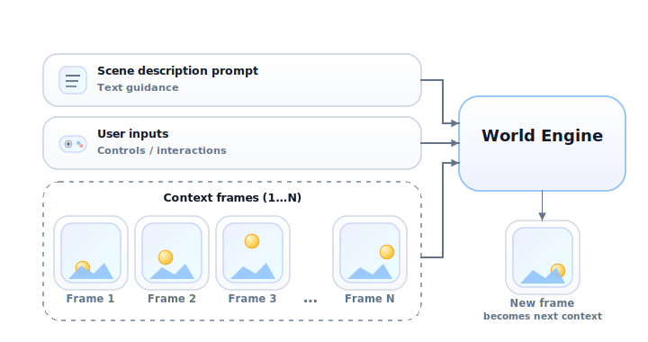

[](https://overworld-world-engine.readthedocs-hosted.com/en/latest/index.html)

<div align="center">

# 🌐 OverWorld Inference Engine

**Core library for World Model inference**

[📖 Documentation](https://overworld-world-engine.readthedocs-hosted.com/en/latest/index.html) ·
[⚡ Quickstart](#quick-start) ·
[✨ Showcase and Examples](#showcase-and-examples)

</div>


<p align="center">
  
</p>

## Overview

Core library for world model inference:

- Simple API to load models and generate image frames from text, control inputs, and prior frames
- Encapsulates the frame-generation stack (DiT, autoencoder, text encoder, KV cache)
- Optimized backends for Nvidia, AMD, Apple Silicon, etc., on consumer and data center GPUs
- Loading base World Models and LoRA adapters

### Out of scope

Not a full client:

- No rendering/display of video or images
- No reading controller/keyboard/mouse input
- No external integrations

Out-of-scope pieces can go in `examples/`, which is **not** part of the `world_engine.*` package.

## Quick Start

#### Setup
```
# Recommended: set up venv
python3 -m venv .env
source .env/bin/activate
```

```
# Install
pip install --upgrade --ignore-installed "world_engine @ git+https://github.com/Overworldai/world_engine.git"
```

```
# Specify HuggingFace Token (https://huggingface.co/settings/tokens)
export HF_TOKEN=<your access token>
```

#### Run
```
from world_engine import WorldEngine, CtrlInput

# Create inference engine
engine = WorldEngine("Overworld/Waypoint-1-Small", device="cuda")

# Specify a prompt
engine.set_prompt("A fun game")

# Optional: Force the next frame to be a specific image
img = pipeline.append_frame(uint8_img)  # (H, W, 3)

# Generate 3 video frames conditioned on controller inputs
for controller_input in [
		CtrlInput(button={48, 42}, mouse=[0.4, 0.3]),
		CtrlInput(mouse=[0.1, 0.2]),
		CtrlInput(button={95, 32, 105}),
]:
	img = engine.gen_frame(ctrl=controller_input)
```

## Usage
```
from world_engine import WorldEngine, CtrlInput
```

Load model to GPU
```
engine = WorldEngine("Overworld/Waypoint-1-Small", device="cuda")
```

Specify a prompt which will be used until this function is called again
```
engine.set_prompt("A fun game")
```

Generate a image conditioned on current controller input (explicit) and history / prompt (implicit)
```
controller_input = CtrlInput(button={48, 42}, mouse=[0.4, 0.3])
img = engine.gen_frame(ctrl=controller_input)
```

Instead of generating, **set** the next frame as a specific image. Typically done as a step before generating.
```
# example: random noise image
uint8_img = torch.randint(0, 256, (512, 512, 3), dtype=torch.uint8)
img = pipeline.append_frame(uint8_img)  # returns passed image
```

Note: returned `img` is always on the same device as `engine.device`

### WorldEngine

`WorldEngine` computes each new frame from past frames, the controls, and the current prompt, then appends it to the sequence so later frames stay aligned with what has already been generated.


### CtrlInput

```
@dataclass
class CtrlInput:
    button: Set[int] = field(default_factory=set)  # pressed button IDs
    mouse: Tuple[float, float] = (0.0, 0.0)  # (x, y) position
```

- `button` keycodes are defined by [Owl-Control](https://github.com/Overworldai/owl-control/blob/main/src/system/keycode.rs)
- `mouse` is the raw mouse velocity vector


## Showcase and Examples

### Tools and clients integrating `world_engine`

- [Overworld.stream](https://overworld.stream)
- [Overworld Biome](https://github.com/Overworldai/Biome/)
- [World Engine Zero (HF Space)](https://huggingface.co/spaces/Overworld/world-engine-zero)
- [Daydream scope-overworld](https://github.com/daydreamlive/scope-overworld)
- [LocalWorld](https://github.com/Overworldai/local_world)

### Examples and Reference Code

- ["Hello (Over)World" client](./examples/simple_client.py)
- [Run Performance Benchmarks (`pytest examples/benchmark.py`)](./examples/benchmark.py)
